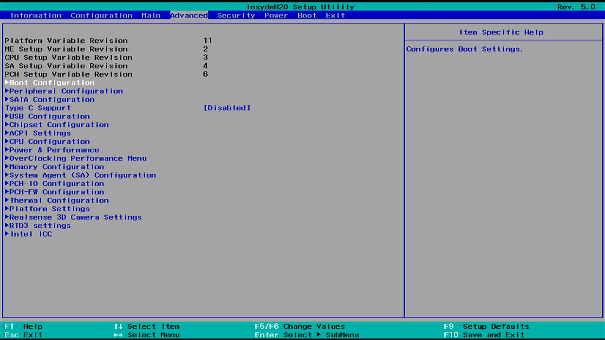
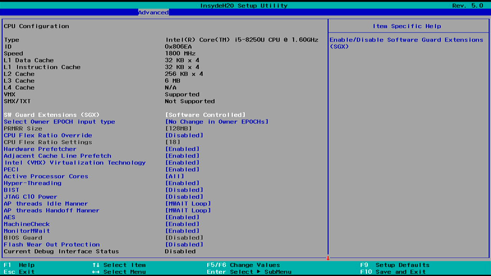
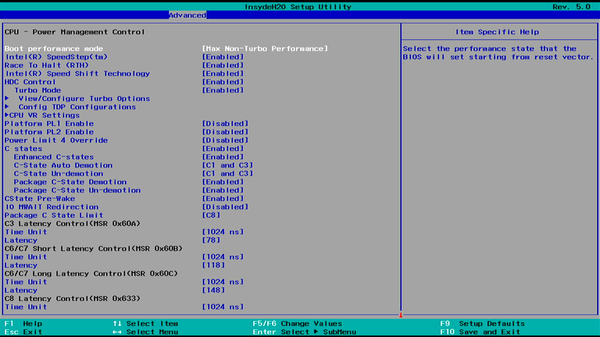
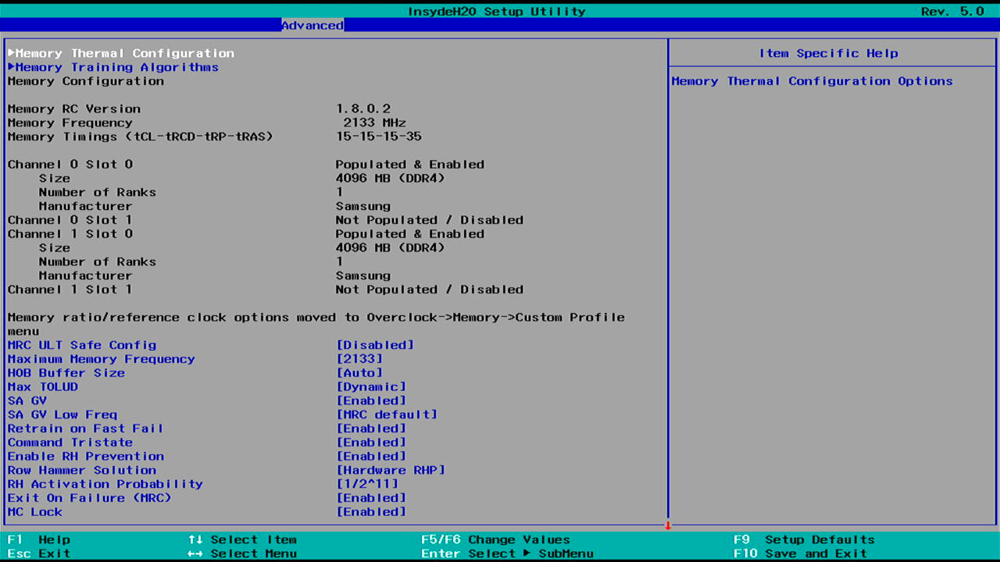
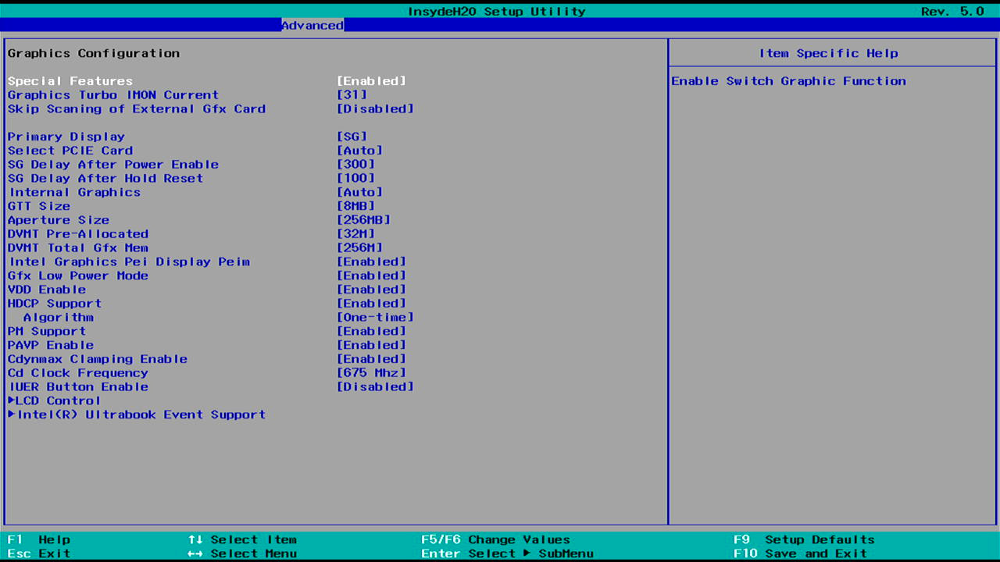
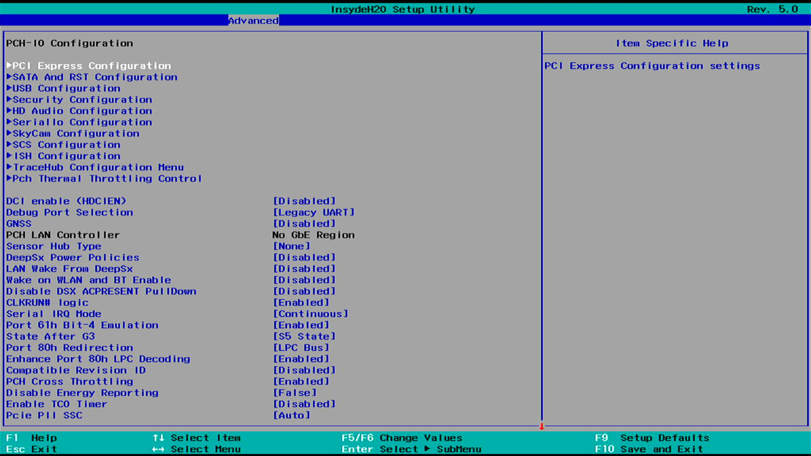

## InsydeH2O-Advanced

Patch to unlock the advanced menu in InsydeH2O BIOS on Lenovo ideapad 520-15IKB. And I'm not talking about the boring "advanced" menu you can find on most motherboard, I'm talking about the one that's hidden from the consumer where you can brick your device if you're not careful.

This method is different than most solutions for other devices because instead of modifying UEFI variable this patch changes the instructions in the BIOS setup module to always show the advanced section. This should make this more resistant to attempts from the manufacturer to hide this menu from the consumer, but also makes this harder and riskier as you have to reflash the whole BIOS.

I'm obviously not responsible for any damages you cause by trying to do this. While it might be possible to flash the modified image from the device, I've only tested this by using a physical SPI flasher.

While I've only tested this on Lenovo ideapad 520-15IKB BIOS version 6jcn32ww, it might also work on other devices using InsydeH2O.

### `enable-advanced.patch`

This is a patch in the UEFIPatch format. To apply it you have to

- Dump you BIOS image
- Download [UEFITool](https://github.com/LongSoft/UEFITool/tree/old_engine) (old_engine branch as the new_engine doesn't yet have UEFIPatch)
- Apply the patch on your BIOS image (be sure to keep a backup)
- Flash the patched image

### `password_reader.py`

As it turns out InsydeH2O BIOS on ideapad 520 keeps the admin and user passwords in plaintext (what could possibly go wrong!).

This small tool allows you to read passwords from your BIOS dump.

### Screenshots

